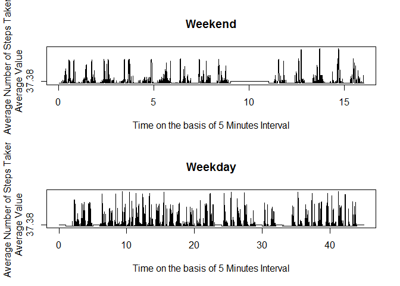

# Reproducible Research: Peer Assessment 1


## Loading and preprocessing the data


```r
   data<-read.csv("activity.csv",stringsAsFactors=FALSE)
   nonMissingData<-subset(data,data[,"steps"]!="NA")
   dataperday<-aggregate(nonMissingData$steps,by=list(nonMissingData$date),sum) 
   names(dataperday)<-c("date","stepsperday")   
```


## What is mean total number of steps taken per day?

1. Historgram of Number of Steps taken per day


```r
   hist(dataperday$stepsperday,main='Histogram of Number of Steps Taken Per Day',xlab='Steps Per Day',col='red')   
```

 

2. Mean and Median total number of steps taken per day 


```r
   meanperday<-mean(dataperday$stepsperday)
   medianperday<-median(dataperday$stepsperday)
```

 The Mean steps taken per day are 1.0766189\times 10^{4} and Median steps taken per day are 10765


## What is the average daily activity pattern?

1. Time Series Plot of 5 minute interval and the average number of steps taken


```r
   steps<-nonMissingData$steps
   plot.ts(x=ts(steps,start=c(0,5),frequency=288),type="l",
           ylab="Average Number of Steps Taken",
           xlab="Time on the basis of 5 Minutes Interval",yaxt="n")
   avg<-signif(mean(steps),digits=4)
   axis(2,at=mean(steps),labels=paste("Average Value",avg,sep="\n"))
```

 

2. The Five Minute Interval contains Maximum number of steps on average across all the days in the dataset


```r
   maxStepRow<-subset(nonMissingData,
                      nonMissingData[,"steps"]==max(nonMissingData$steps))
```

 The 5 Minute interval Interval 610 to 615 on 2012-11-27 has maximum value of number of steps taken which is 806 

## Imputing missing values

1. Total number of Missing Values


```r
   wholerowmissing<-subset(data,is.na(data[,"steps"])|
                              is.na(data[,"date"])|
                              is.na(data[,"interval"]))
   missingCount<-length(wholerowmissing$steps)
```

   Total Number of missing rows in this data set is 2304

2. Filling of Missing Values on the basis of average number of steps taken

   Every "NA" values will be replaced with 37.38 which is average number of  
steps taken

3. New Dataset with the missing data filled in with 37.38 which is average number of steps taken


```r
   index<-is.na(data$steps)
   filledsteps<-replace(data$steps,index,values=avg)
   cdata<-cbind(data,filledsteps)
   newData<-data.frame(cdata$filledsteps,cdata$date,cdata$interval,
                       stringsAsFactors = FALSE)
   names(newData)<-c("steps","date","interval")
```

4. Historgram of Number of Steps taken per day in new Data and Report of Mean and 
Median total number of teps and Impact of imputing Missing data on estimates
   
   Historgram of Number of Steps taken per day
   

```r
   dataperdaynewData<-aggregate(newData$steps,by=list(newData$date),sum) 
   names(dataperdaynewData)<-c("date","stepsperday")   
   hist(dataperdaynewData$stepsperday,main='Histogram of Number of Steps Taken Per Day',xlab='Steps Per Day',col='red')
```

 

   Mean and Median total number of steps taken per day 


```r
   meanperdaynewData<-mean(dataperdaynewData$stepsperday)
   medianperdaynewData<-median(dataperdaynewData$stepsperday)
   meanDifference<-meanperdaynewData-meanperday
   medianDifference<-medianperdaynewData-medianperday
```

   The Mean steps taken per day are 1.076609\times 10^{4} and Median steps taken       
per day in new Data are 1.076544\times 10^{4}
   
   The Difference between mean of missing value data and missing values filled data is: -0.0981874 and between Median of missing value data and missing value filled data is: 0.44

The impact of Missing Value is not much significant in both mean and median.

## Are there differences in activity patterns between weekdays and weekends?

1. Creation of dataset with two levels


```r
   factoreddata<-transform(newData,date=as.Date(date,format="%Y-%m-%d"))
   weekdays<-weekdays(factoreddata$date)
   j<-1
   for(i in weekdays){
      if(i=="Saturday"|i=="Sunday"){
         weekdays[j]<-"Weekend"      
      }
      else{
         weekdays[j]<-"Weekday"
      }
      j<-j+1
   }
   weekdays<-as.factor(weekdays)
   weekdata<-cbind(newData,weekdays)
```

2. A panel plot containing a time series plot (i.e. type = "l") of the 5-minute interval (x-axis) and the average number of steps taken, averaged across all weekday days or weekend days (y-axis)


```r
   splittedData<-split(weekdata,weekdata$weekdays)
   weekdaysteps<-splittedData$Weekday   
   weekendsteps<-splittedData$Weekend

   avgweekend<-signif(mean(weekendsteps$steps),digits=4)
   avgweekday<-signif(mean(weekdaysteps$steps),digits=4)
   par(mfrow=c(2,1))
   plot.ts(x=ts(weekendsteps$steps,start=c(0,5),frequency=288),type="l",
           ylab="Average Number of Steps Taken",main="Weekend",
           xlab="Time on the basis of 5 Minutes Interval",yaxt="n")
   axis(2,at=avgweekend,labels=paste("Average Value",avg,sep="\n"))
   
   plot.ts(x=ts(weekdaysteps$steps,start=c(0,5),frequency=288),type="l",
           ylab="Average Number of Steps Taken",
           xlab="Time on the basis of 5 Minutes Interval",main="Weekday",yaxt="n")
   axis(2,at=avgweekday,labels=paste("Average Value",avg,sep="\n"))
```

 
